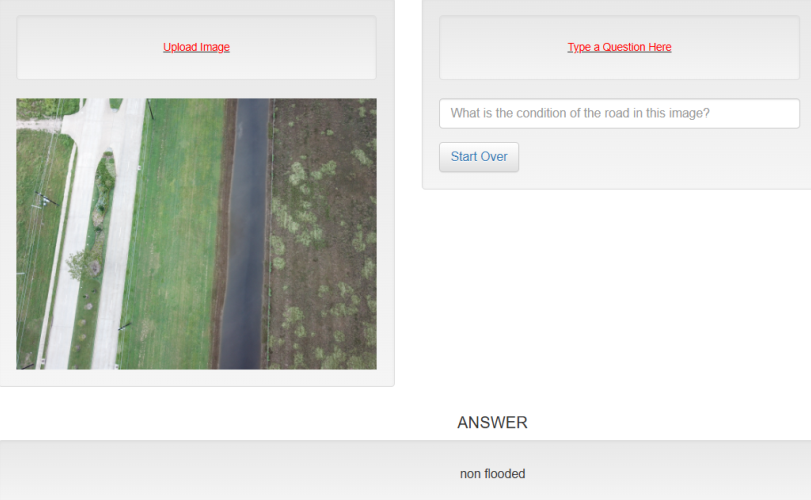

# Visual Question Answering System with YOLO, BERT, and GPT-2 🌊💡

## 🌟 Project Description
This Visual Question Answering (VQA) project combines state-of-the-art deep learning techniques to answer questions about images. It integrates **YOLOv8** for image feature extraction, **BERT** for question understanding, and **GPT-2** for answer generation. The system takes an image and a question as input, processes them through a unified pipeline, and outputs the corresponding answer.

---
## 🛠️ Overview

The VQA pipeline includes:
- Text tokenization and embedding using **BERT**.
- Object detection and feature extraction using **YOLOv8**.
- Unified feature representation fed to **GPT-2** for answer generation.

Based on input images, the application can answer questions such as "How many flooded buildings are visible?" or "Is the road flooded?"

---

## 💡 Project Objectives
- Combine visual and textual features for VQA tasks.
- Use a pre-trained **YOLOv8** for object detection.
- Encode textual questions using **BERT**.
- Utilize **GPT-2** for generating textual answers.

---

## 🎨 Models Used
1. **YOLOv8**: Object detection and feature extraction.
2. **BERT**: Text encoding for understanding input questions.
3. **GPT-2**: Generating answers based on combined features.

---

## 🧪 Key Features
1. **Multimodal Input Handling**:
   - Accepts both text (questions) and images as inputs.
   - Processes visual and textual data through specialized models.

2. **Pipeline Integration**:
   - Extracts image features with YOLOv8.
   - Encodes textual questions with BERT.
   - Combines features to generate answers using GPT-2.

3. **End-to-End Training**:
   - Supports training, validation, and prediction pipelines in separate notebooks (`train.ipynb`, `validation.ipynb`, `prediction.ipynb`).

4. **Scalable Design**:
   - Modular architecture ensures extensibility and adaptability to other datasets or tasks.

---

## 🔧 Process Flow

### 1. Question Input
- The user provides a question related to the image.
- This input serves as a query for the VQA model to process.

### 2. BERT Tokenization
- The question text is tokenized into:
  - **Input IDs**: Numerical representations of the tokens in the question.
  - **Attention Masks**: Binary masks indicating whether a token is real (1) or padding (0).

### 3. BERT Embedding
- The tokenized question is passed through the **BERT model** to produce:
  - **Text Embeddings**: High-dimensional vector representations derived from the `[CLS]` token's pooler output.

### 4. Image Input
- The user provides an image related to the question.
- This visual input is processed to extract relevant features.

### 5. YOLO Feature Extraction
- The image is processed using the **YOLOv8 model** to detect objects and extract:
  - **Bounding Box Coordinates**: Location of objects in the image.
  - **Confidence Scores**: Probability of object presence.
  - **Class Values**: Detected object categories.

### 6. Feature Combination
- Text embeddings from BERT and image features from YOLO are combined to form a unified representation integrating textual and visual information.

### 7. Projection to GPT-2 Dimension
- A **Linear Layer** maps the combined features to the input dimension required by GPT-2.

### 8. Answer Generation with GPT-2
- The projected features are fed into the **GPT-2 model** to generate an answer:
  - **Logits**: GPT-2 outputs a probability distribution over possible answers.
  - **Final Answer**: The system selects the most probable answer.


---

## 🔧 Installation and Setup

### Clone the Repository
```bash
git clone <repository_link>
cd <repository_folder>
```

### Install Dependencies
```bash
pip install ultralytics transformers torch torchvision tqdm pillow
```

### Verify Installation
```python
import ultralytics
ultralytics.checks()
```

### 📂 Dataset
The project uses the **[**FloodNet Challenge (EarthVision 2021 - Track 2)**](https://github.com/BinaLab/FloodNet-Challenge-EARTHVISION2021?fbclid=IwAR2XIwe5nJg5VSgxgCldM7K0HPtVsDxB0fjd8cJJZfz6WMe3g0Pxg2W3PlE)**, which includes images and corresponding questions.
- **Images:** UAV-captured images of flood scenes.
- **Questions:** Structured natural language queries about the scenes.
- **Answers:** Ground-truth labels for the queries.
  
#### Dataset Structure
- **Images Directory:** Contains raw images for training and testing.
- **Annotations File (JSON):** Maps image IDs to:
  - Questions.
  - Ground truth answers.
  - Question types (e.g., Yes/No, Counting, Condition Recognition).

```
FloodNet/
├── Images/
│   ├── Train_Image/
│   ├── Validation_Image/
├── Questions/
│   ├── Training_Questions.json
│   ├── Validation_Questions.json
```

#### Data Processing:
- Images are resized to **224x224**.
- Questions are tokenized using **BERTTokenizer**.
- Labels (answers) are encoded using a predefined **label mapping**.

---

## Directory Structure
```
repo/
├── Code/
│   ├── train.ipynb
│   ├── validation.ipynb
│   ├── prediction.ipynb
├── Dataset/
│   ├── FloodNet/
├── Results/
│   ├── Logs/
│   ├── Checkpoints/
│   └── Predictions/
└── README.md
```

---

## 🚀 Training Pipeline (`train.ipynb`)
1. **Load Dataset**:
   - Import training data and split it into batches.
   
2. **YOLO Feature Extraction**:
   - Extract features from training images using pre-trained YOLOv8.

3. **BERT Embedding**:
   - Tokenize and encode questions using BERT.

4. **Feature Combination**:
   - Combine YOLO and BERT features into a unified representation.

5. **Answer Generation**:
   - Train GPT-2 on combined features to predict answers.

6. **Loss Calculation**:
   - Use cross-entropy loss for optimizing predictions.

---

## 🚀 Validation Pipeline (`validation.ipynb`)
1. Load the validation dataset.
2. Evaluate the model's performance by comparing predicted answers to ground truths.
3. Log key metrics:
   - Accuracy
   - Cross-entropy loss

---

## 🚀 Prediction Pipeline (`prediction.ipynb`)
1. Load test data (images and questions).
2. Generate predictions using the trained model.
3. Save outputs in a JSON file with the following structure:
   ```json
   {
       "image_id": "image_1.jpg",
       "question": "Is the road flooded?",
       "predicted_answer": "Yes"
   }
   ```

---

## 🛠️ Model Architecture

### YOLOv8
- Performs object detection to identify key objects in the image.
- Outputs:
  - Bounding boxes
  - Confidence scores
  - Class values

### BERT
- Processes the question to create a contextual embedding.
- Outputs:
  - High-dimensional vector representation of the question.

### GPT-2
- Combines textual and visual embeddings to generate an answer.
- Outputs:
  - Logits representing probabilities for each token in the answer.

---

## 🔧 Hyperparameters
- **Learning Rate**: `1e-5`
- **Batch Size**: `64`
- **Epochs**: `30`
- **Image Size**: `(224, 224)`
- **Hidden Dimension**: `256`

---

## 🛠️ Code Breakdown

1. **Dependencies and Setup**
   - `google.colab.drive` is used to mount Google Drive to access datasets and pre-trained models.
   - Libraries such as `torch`, `transformers`, and `ultralytics` are used for deep learning tasks, YOLOv8 object detection, and NLP.
   - The device (CPU/GPU) is identified and used throughout the script.

2. **YOLOv8 Model for Object Detection**
   - A pre-trained YOLOv8 model is loaded from the specified path for feature extraction.
   - The model identifies objects in images and returns bounding boxes, confidence scores, and class labels.

3. **Label and Question Type Mapping**
   - A label mapping defines possible answers (e.g., "flooded", "non-flooded", numeric values).
   - A question type mapping categorizes questions into four types: condition recognition, yes/no questions, simple counting, and complex counting.

4. **Feature Extraction**
   - **Function `extract_yolo_features`**:
     - Processes an image through YOLOv8.
     - Extracts bounding boxes, confidence scores, and class labels.
     - Combines these features into a tensor for further use.

5. **Dataset Class (`VQADataset`)**
   - Loads the dataset (images and questions) from JSON annotation files.
   - Groups annotations by image and processes images using transformations (resize, tensor conversion).
   - Tokenizes questions using BERT tokenizer, matches answers to the label mapping, and maps question types.

6. **Custom Collation**
   - A custom collate function (`custom_collate_fn`) is defined for `DataLoader` to handle variable numbers of questions per image.
   - Aggregates image paths, questions, attention masks, answers, and question types into batches.

7. **VQA Model Architecture**
   - **Class `VQAModel`**:
     - Combines features from YOLOv8 (processed by a fully connected layer) and text embeddings from BERT.
     - Projects the combined features to a suitable input dimension for GPT-2.
     - Uses GPT-2 for generating answers in logits form.

8. **Validation Function**
   - **Function `validate_model`**:
     - Evaluates the model on a test dataset.
     - Extracts image features using YOLOv8 and processes questions using BERT.
     - Computes predictions using GPT-2 and compares them to ground truth answers.
     - Tracks accuracy, loss, and performance metrics for each question type.

9. **Initialization**
   - Tokenizers for BERT and GPT-2 are initialized.
   - Pre-trained weights for BERT, GPT-2, and the VQA model are loaded.
   - A test dataset and dataloader are prepared using the custom dataset class and collate function.

10. **Validation**
    - The model is validated using the `validate_model` function:
      - Overall accuracy and loss are calculated.
      - Metrics for each question type are printed (e.g., accuracy, average loss).

---

## 🔧 Key Components and Purpose

1. **YOLOv8 Feature Extraction**:
   - Extracts spatial features from images relevant to flood detection.

2. **BERT for Question Understanding**:
   - Encodes questions into numerical embeddings for model input.

3. **GPT-2 for Answer Prediction**:
   - Generates logits (probabilities) corresponding to possible answers.

4. **Integration of Image and Text Features**:
   - Combines image features with question embeddings to form a unified input for answer generation.

5. **Evaluation Metrics**:
   - Reports accuracy and loss for overall predictions and by question type, helping to assess model performance comprehensively.

---

## 🎨 Expected Workflow

1. Images and their associated questions are processed.
2. Image features are extracted using YOLOv8.
3. Questions are tokenized and embedded using BERT.
4. Combined features are passed through the VQA model.
5. The model generates predictions, which are evaluated against ground truth answers.


---


## 💡 Results and Evaluation
### Training Results
- **Accuracy**: 65%
- **Loss**: 0.9

### Validation Results
- **Accuracy**: 64% (Placeholder)

### Example Predictions
| **Question**          | **Image**            | **Answer**    |
|------------------------|----------------------|---------------|
| Is the road flooded?   | Road_Image.jpg       | Yes           |
| How many flooded buildings?| Flooded_Areas.jpg   | 3         |




---

## 💡 Usage

### Single Prediction
```python
from predict import predict
question = "Is the road flooded?"
image_path = "/path/to/image.jpg"
answer = predict(image_path, question)
print("Answer:", answer)
```

### Batch Prediction
```bash
python predict.py --dataset /path/to/test.json
```

---

## 💬 **Contributing**

We welcome contributions! If you have ideas or improvements:
1. Fork the repository.
2. Create a new branch: `git checkout -b my-feature-branch`.
3. Submit a pull request.


## 💬 **Contact**

Feel free to open an issue or reach out for collaboration!  

**Author**: *Abdelkadir Sellahi*

**Email**: *abdelkadirsellahi@gmail.com* 

**GitHub**: [Abdelkadir Sellahi](https://github.com/AbdelkadirSellahi)
